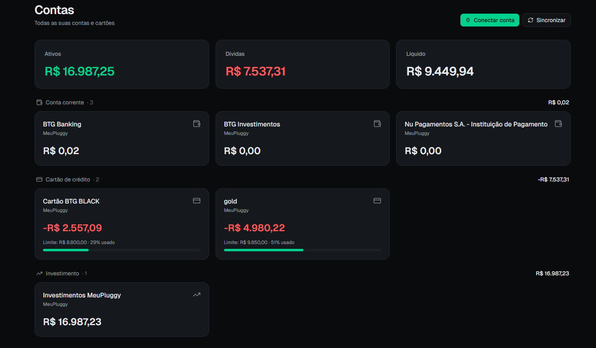
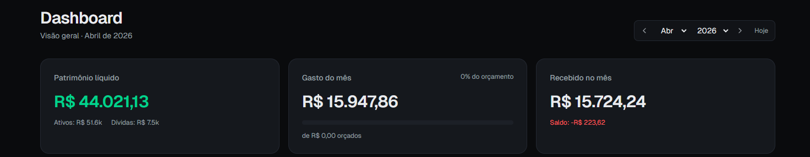
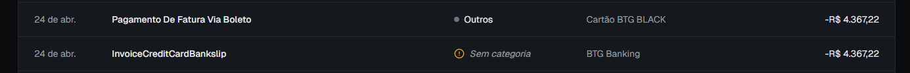
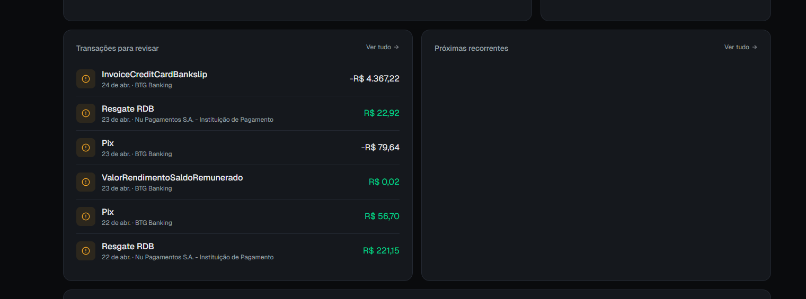
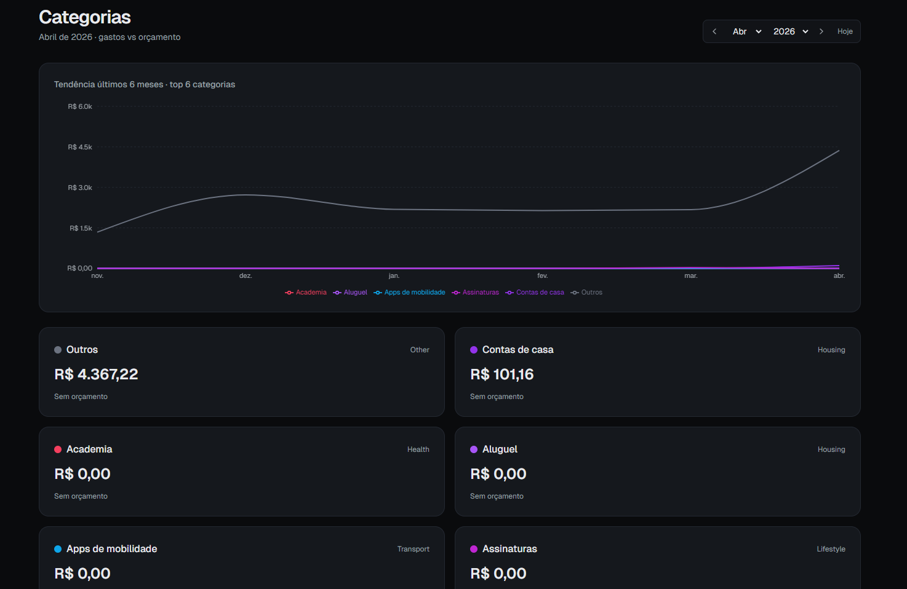
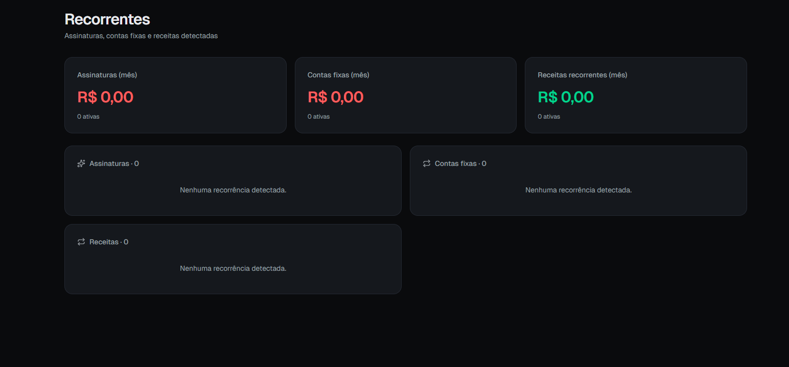
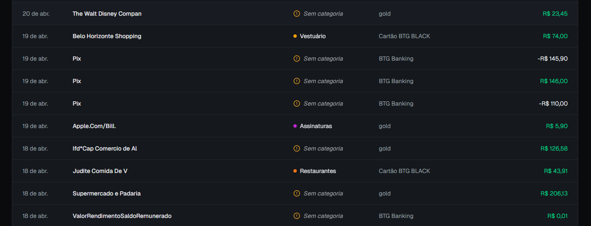
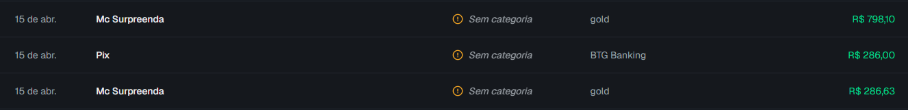

Issues on 27/04 at 7:54pm
I don't want you to manually fix any of these problems, I want you to generalize so these types of problems won't appear again.

- the "contas" page has all the right values, i dont know why the other pages are not replicating these values.

- Toda vez que eu clico em sincronizar na aba contas o valor do meu patrimonio cresce aproximadamente 17k
- Impossivel os gastos no mes terem chegado a 15mil reais
- Impossivel os meus recebidos terem chegado a 15mil reais, eu tenho um salario de 5.600 +- e meus pais me ajudam com aluguel e condominio que, juntos, chegam a mais ou menos 2600 reais.

- Esses 2 valores parecem estar repetidos, eles dizem respeito à mesma transação que foi o pagamento da minha fatura.

- pooderia ser possivel revisar as transações diretamente do dashboard (adicionar uma categoria à ela)

- na pagina de categorias, os valores de cada categoria não estão sendo mostrados corretamente. A maioria está zerado

- impossivel não ter detectado nenhuma recorrencia

- Pix claramente são transferencias, apple.com/bill é assinatura, the walt disney company é assinatura, barbearia deveria ser facil de detectar,

- essas compras do mc surpreenda são compras das mastercard surpreenda que foram coisas para casa (lençol e edredom)

- I also wanted to update one transaction's category and have that propagate to all the same transactions, exactly.

- I also think there should be more categories like: shopping for house, gifts, a category for barber, for pharmacy, etc. So either let me also create more categories or come up with a bunch more in a way that the app still learns from them.